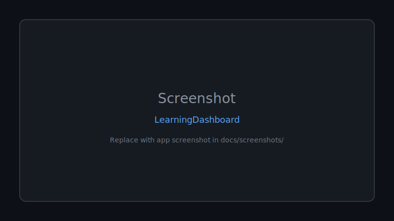

<div align="center">

# 🚀 Learningdashboard

**A .NET 8 Blazor Server learning dashboard that tracks course progress, includes daily quotes, and persists data using SQLite.**

Documented · MIT licensed · Maintained


[](LICENSE)
[](CONTRIBUTING.md)

[Features](#-features) · [Quick Start](#-quick-start) · [Screenshots](#-screenshots) · [Contributing](CONTRIBUTING.md)

</div>

---

## 🖼 Screenshots



*Replace `docs/screenshots/placeholder.svg` with real app screenshots.*

---

## 🐍 Contribution graph


<picture>
  <source media="(prefers-color-scheme: dark)" srcset="https://raw.githubusercontent.com/mafzalkalwardev/LearningDashboard/output/snake-dark.svg" />
  <source media="(prefers-color-scheme: light)" srcset="https://raw.githubusercontent.com/mafzalkalwardev/LearningDashboard/output/snake.svg" />
  
</picture>


---

<!-- SEO -->
.NET 8 | ASP.NET Core | Blazor Server | Learning Dashboard | Course Progress Tracker | SQLite | Interactive Server Components

A **.NET 8 (ASP.NET Core Blazor Server)** learning dashboard that tracks **course progress**, provides a **daily quote**, and persists user data in **SQLite**.

---

## Highlights

- **Course Progress Tracking**: view courses, lessons, completion status, and overall progress.
- **User Session**: login/logout flow with protected dashboard routing.
- **Daily Quote**: fetches a quote from `zenquotes.io` via `HttpClient`.
- **SQLite Persistence**: auto-creates the database (`app.db`) on first run.

---

## UI Showcase (GitHub-friendly)

### Trophy cards (stats)

<div align="left">
  
</div>

### Project stats

<div align="left">
  
  
</div>

### Activity graph

<div align="left">
  
</div>

---

## Skill icons

<div align="left">
  
  
  
  
  
  
</div>

---

## Custom project showcase

**Core modules**:
- **Components**: layout, navigation menu, routed pages (home, courses, course details, login/register, profile, settings, progress).
- **Data**: `AppDbContext` + EF Core migrations for `Users`.
- **Services**: course storage, theme selection, user session, and `QuoteService`.

---

## Profile views

<div align="left">
  
</div>

---

## Contribution snake

<div align="left">
  
</div>

---

## Tech Stack

- **ASP.NET Core Blazor Server** (Interactive Server Components)
- **.NET 8**
- **EF Core + SQLite**
- **Bootstrap** (UI styling)
- **zenquotes.io** (daily quotes)

---

## Run locally

```bash
dotnet restore
dotnet run
```

The app will auto-create the SQLite database (`app.db`) on first run.

---

## Repo setup (GitHub)

- `bin/`, `obj/`, and `app.db` are excluded via `.gitignore`.

---

## License

MIT

## Screenshots


